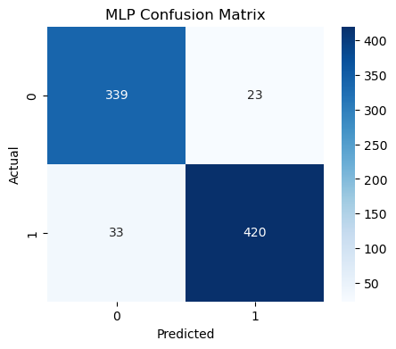
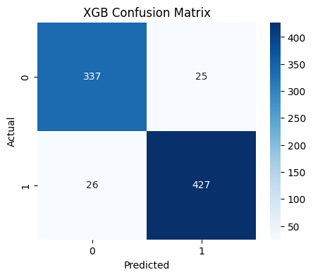
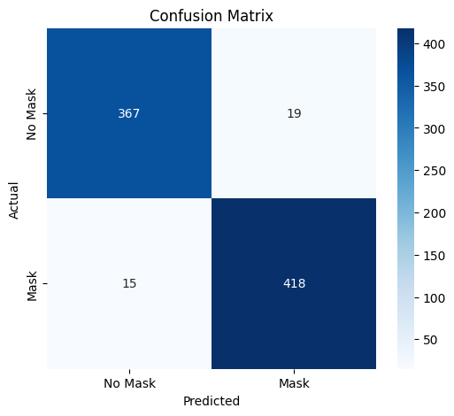
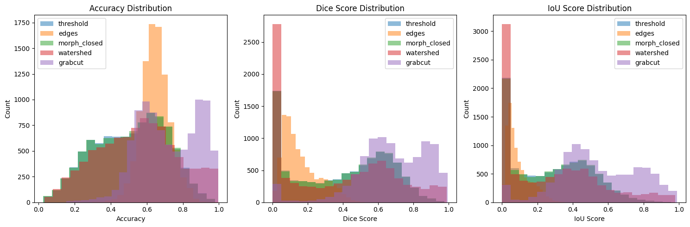
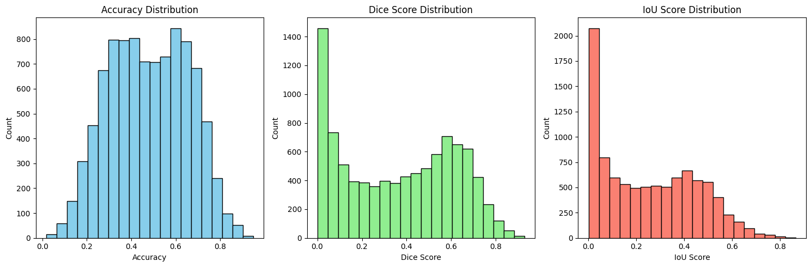
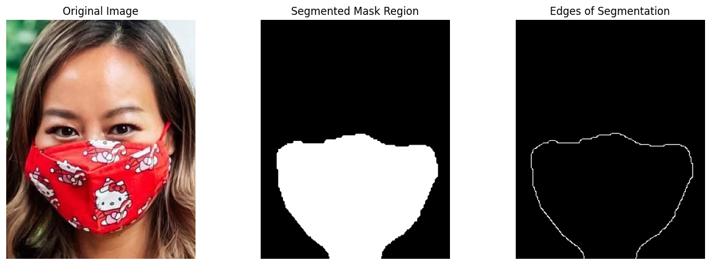

# Face Mask Detection, Classification, and Segmentation

This project aims at developing a computer vision solution to classify and segment face masks in images. It uses handcrafted features with machine learning classifiers and deep learning techniques to perform classification and segmentation.

## Contributors:

(IMT2022007) Trupti Khodwe <Trupti.Khodwe@iiitb.ac.in>

(IMT2022050) Shiven Phogat <Shiven.Phogat@iiitb.ac.in>

(IMT2022051) Rishabh Dixit <Rishabh.Dixit@iiitb.ac.in>


# Classification tasks

We used the dataset available at [Face-Mask-Detection](https://github.com/chandrikadeb7/Face-Mask-Detection/tree/master/dataset). This dataset consists of labeled images of individuals wearing face masks and those without masks. 

- **Categories:**
  - `with_mask` (label = 1)
  - `without_mask` (label = 0)
- **Total Samples:** 4095 images
- **Train-Test Split:** 80% training, 20% testing
---
## Part-A: Binary Classification Using Handcrafted Features and ML Classifiers

### i. Introduction
This project focuses on classifying images into two categories: "with mask" and "without mask" using **Support Vector Machine (SVM), Neural Network (MLPClassifier) & XGBoost** models. Handcrafted feature extraction techniques such as **Histogram of Oriented Gradients (HOG)**, **Local Binary Patterns (LBP)**, and **texture descriptors** are used for feature representation. The objective is to compare the performance of these traditional machine learning models for binary classification.

### ii. Methodology
The project follows these steps:
1. **Loading Dataset:** Images are loaded from folders and labeled accordingly, resized to **128x128 pixels** and preprocessed before feature extraction.
2. **Preprocessing:** Images are resized and converted to grayscale.
3. **Feature Extraction:**
   - **HOG**: Extracts edge-based features using the Histogram of Oriented Gradients (HOG) descriptor.
   - **LBP**: Computes texture-based features using Local Binary Patterns (LBP).
   - **Canny Edge Detector**: Detects strong edges by applying gradient analysis and non-maximum suppression.
   - **Color Histogram**: Extracts color distribution features by computing a 3D HSV color histogram and flattening it.
4. **Model Training:**
   - **SVM (Support Vector Machine)** with different kernels.
   - **MLPClassifier (Multi-Layer Perceptron Neural Network)**.
   - **XGBoost** with GridSearchCV to search for best parameters.
5. **Evaluation:** Models are evaluated using **accuracy, confusion matrix, and classification report**.

### iii. Hyperparameters and Experiments
- **First Approach:**
  - **Feature Extraction:**
    - Using the 4 methods mentioned above.
  - **SVM**:
    - Kernel: Linear
    - SVM Accuracy: **0.9263803680981595**
  - **MLPClassifer:**
    - Hidden Layers: `(100, )`
    - Max Iterations: `500`
    - Activation: ReLU
    - Solver: Adam (Default)
    - MLP Accuracy: **0.9251533742331288**

- **Second Approach:**
  - **Changes in the feature extraction:**
    - Adjusted HOG parameters, increased pixels_per_cell and decreased cells_per_block.
    - Adjusted LPB parameters, increased radius and decreased n_points.
    - Adjusted Canny parameters, reduced threshold values.
  - **SVM:**
    - Kernel: Linear
    - SVM Accuracy: **0.9447852760736196**
  - **MLPClassifer:**
    - Hidden Layers: `(128, 64)`
    - Max Iterations: `1000`
    - Activation: ReLU
    - Solver: Adam (Default)
    - MLP Accuracy: **0.9312883435582822**

- **Third Approach:**
  - **Same feature extraction as previous apporach:**
  - **SVM:**
    - Kernel: RBF
    - Regularization: `C=1.0`
    - Gamma: `scale`
    - SVM Accuracy: **0.9226993865030675**
  - **XGBoost (Best Parameters with GridSearchCV):**
    - CV = 2
    - Best Parameters: {'learning_rate': 0.1, 'max_depth': 3, 'n_estimators': 150}
    - XGBoost Accuracy: **0.9374233128834356**


### iv. Results
The models were evaluated using **accuracy** and **confusion matrix**:
- **SVM:** Accuracy = **94.48%**
- **MLPClassifier:** Accuracy = **93.13%**
- **XGBoost:** Accuracy = **93.74%**

Detailed evaluation metrics such as Precision, Recall, and F1-Score are provided in the classification report.

### v. Observations and Analysis
- Changing the parameters during feature extraction (such as HOG) contributed significantly to classification accuracy.
- Best results were obtained when SVM was trained with a linear kernel with the modified feature extraction.
- Challenges included selecting optimal feature extraction parameters and the training of the large dataset was also time consuming.

---

## Part-B: Binary Classification Using CNN

### i. Introduction
This project focuses on using a Convolutional Neural Network (CNN) to classify images of faces as either "with mask" or "without mask." The objective is to develop an end-to-end deep learning pipeline that leverages CNNs for binary classification and compare its performance against traditional machine learning classifiers.

### ii. Methodology
- **Data Preprocessing:**
    - Images were resized to **128x128 pixels**.
    - Normalized pixel values to the range **[0,1]**.
    - Splitting dataset into training and testing sets using an 80-20 ratio.

- **CNN Model Architecture:**
    The CNN model was designed as follows:
    - **Convolutional Layers:**
    - Conv2D (32 filters, 3x3 kernel, ReLU activation)
    - MaxPooling2D (2x2)
    - Conv2D (64 filters, 3x3 kernel, ReLU activation)
    - MaxPooling2D (2x2)
    - Conv2D (128 filters, 3x3 kernel, ReLU activation)
    - MaxPooling2D (2x2)
    - **Flatten Layer**
    - **Fully Connected Layers:**
    - Dense (128 neurons, ReLU activation)
    - Dropout (0.5)
    - Dense (1 neuron, Sigmoid activation)
    - **Loss Function:** Binary Crossentropy
    - **Optimizer:** Adam

- **Hyperparameter Variations:**
    We experimented with the following hyperparameters:
    - **Learning Rates:** 0.001, 0.0001
    - **Batch Size:** 32
    - **Epochs:** 10 (Baseline), 5 (for variations)
    - **Optimizers:** Adam with different learning rates

### iii. Results
| Model Variation | Train Accuracy | Validation Accuracy |
|---------------|---------------|----------------|
| Base Model (lr=0.001) | 98.06% | 95.85% |
| Learning Rate = 0.0001 | 99.91% | 96.83% |
| Learning Rate = 0.001 (Reduced Epochs) | 99.14% | 95.85% |

### iv. Observations and Analysis
- CNN significantly outperforms traditional ML classifiers in accuracy.
- Decreasing the learning rate improved generalization slightly.
- Dropout helped prevent overfitting.
- The model is robust but can be further improved with augmentation and more complex architectures.


## How to Run the Code
### 1. Install Dependencies
```sh
pip install tensorflow numpy matplotlib opencv-python seaborn scikit-image
```
### 2. Clone Dataset Repository
```sh
git clone https://github.com/chandrikadeb7/Face-Mask-Detection.git
```
### 3. Run the Script
Execute the Python script or Jupyter Notebook containing the CNN model implementation [classification.ipynb](classification.ipynb).

## Confusion Matrix for different classification approaches:




#### CNN:


---

# Segmentation tasks

We used the dataset available at [Face-Mask-Segmentation](https://github.com/sadjadrz/MFSD).
The dataset consists of cropped face images from the MSFD dataset.

- Face Images: Located in `..\MSFD\1\face_crop`
- Mask Segmentation Labels: Located in `..\MSFD\1\face_crop_segmentation`

## Part-C: Region Segmentation Using Traditional Techniques

### i. Introduction

This project applies multiple traditional image segmentation techniques for mask segmentation. The `segmentation.ipynb` notebook evaluates different segmentation methods, processes image masks, and computes segmentation quality metrics.

### ii. Methodology

The project implements multiple segmentation techniques:

- **Data Loading and Preprocessing:**
    - Reads images and corresponding ground truth masks.
    - Converts images to grayscale and applies Gaussian blurring.
    - Normalizes and resizes images for uniform processing.

- **Segmentation Techniques:**
    - **Otsu's Thresholding:** Automatically determines an optimal threshold value to binarize the image.
    - **Canny Edge Detection:** Identifies edges based on gradient intensity.
    - **Morphological Closing:** Fills small holes in the binary mask using dilation and erosion.
    - **Watershed Algorithm:** Separates foreground and background regions using marker-based segmentation.
    - **GrabCut Segmentation:** Interactive foreground segmentation method using graph cuts.
    - **K-Means Clustering:** Segments the image into clusters based on pixel intensity similarities.

- **Evaluation Metrics:**
    - **Dice Coefficient:** Measures overlap between predicted and ground truth masks.
    - **IoU (Intersection over Union):** Evaluates segmentation quality.
    - **Accuracy:** Computes pixel-wise correctness of segmentation.

### iii. Hyperparameters and Experiments

- **Baseline Segmentation Methods:**
    - Applied to all images using default parameters.
    - Computed segmentation masks for each method.
    - Evaluated performance using IoU and Dice Score.

- **Improved Segmentation with K-Means Clustering:**
    - Applied K-Means with **k=2** clusters for binary segmentation.
    - Compared results with traditional methods.
    - Fine-tuned clustering parameters to improve segmentation quality.

### iv. Results

The segmentation quality is evaluated using accuracy, Dice Score, and IoU.

| Segmentation Method | Dice Score (%) | IoU Score (%) |
|----------------------|---------------|--------------|
| Otsu's Thresholding |      0.394348  |    0.281106           |
| Morphological Closing | 0.397349            | 0.283493           |
| Watershed Segmentation | 0.370153               | 0.277277           |
| GrabCut Segmentation | 0.672323     | 0.540645           |
| K-Means Clustering | 0.363973            | 0.252885           |

### v. Observations and Analysis

- **Thresholding and Morphological Operations:** Perform well for simple segmentations but struggle with complex boundaries.
- **Edge Detection:** Useful for detecting boundaries but not suitable for full segmentation.
- **Watershed and GrabCut:** Provide refined segmentations but require manual tuning.
- **K-Means Clustering:** Effective for automatic segmentation but sensitive to initialization.
- **Dice and IoU Metrics:** Provide insights into segmentation accuracy, showing strengths and weaknesses of each method.

### vi. Conclusion

This project explores multiple traditional segmentation methods, evaluating their effectiveness on facial mask segmentation. While Otsu's thresholding and morphological techniques provide basic segmentation, methods like GrabCut and K-Means Clustering offer more refined results. Future work includes integrating deep learning-based segmentation models for further improvement.

---

## Part-D: Mask Segmentation Using U-Net


### i. Introduction
This project implements a U-Net model for mask segmentation. It processes images of faces and segments the mask regions using deep learning.

### ii. Methodology
The project follows these steps:
1. **Loading Dataset:** 
    - Image and mask pairs are loaded from predefined directories.
    - Preprocessing includes resizing and normalization.
    - Images are resized to **128x128**.

2. **Methodology:**
    - **Model Architecture:**
        - Comprises of 3 main sections: **Encoder**, **Bridge** & **Decoder**.
        - Implemented using Conv2D, MaxPooling2D, UpSampling2D, and concatenate layers.
        - Complied with different parameters in different approaches.
        
    - **Training Process:** 
        - Enabled mixed precision training to improve training speed and reduce memory usage with no effect on accuracy.
        - Trained with different parameters in different approaches.

### iii. Hyperparameters and Experiments
- **First Approach: Basic U-Net Model**
    - **Model Architecture:**
        - Encoder with three convolutional blocks and max-pooling layers.
        - Bridge layer with dropout.
        - Decoder with upsampling and concatenation.
        - Output layer with a single convolutional filter and sigmoid activation.
    - **Compilation Parameters:**
        - **Optimizer:** Adam (learning rate = 1e-4)
        - **Loss Function:** Binary Crossentropy
        - **Metrics:** Accuracy, Mean IoU (num_classes=2)
    - **Training Parameters:**
        - **Batch Size:** 8
        - **Epochs:** 20
        - **Callbacks:** 
          - ModelCheckpoint (save best model based on validation loss)
          - EarlyStopping (patience = 10, stops training if validation loss doesn’t improve for 10 epochs and restores the best model weights.)        

- **Second Approach: Improved U-Net with Batch Normalization and Leaky ReLU**
    - **Model Architecture:**
        - Uses Batch Normalization after each convolutional layer.
        - Uses LeakyReLU instead of ReLU for better gradient flow.
        - Adds a ReduceLROnPlateau callback to adjust learning rate dynamically.
    - **Compilation Parameters:**
        - **Optimizer:** Adam (learning rate = 1e-4)
        - **Loss Function:** Binary Crossentropy
        - **Metrics:** Accuracy, Mean IoU (num_classes=2)
    - **Training Parameters:**
        - **Batch Size:** 16
        - **Epochs:** 50
        - **Steps Per Epoch:** len(X_train) // batch_size
        - **Callbacks:** 
          - ModelCheckpoint
          - EarlyStopping
          - ReduceLROnPlateau (factor = 0.5, patience = 3, min_lr = 1e-6) (Reduces the learning rate when the metric (e.g., validation loss) stops improving, helping the model converge more efficiently.)

- **Third Approach: U-Net with Modular Encoder and Decoder Blocks**
    - **Model Architecture:**
        - Implements reusable encoder and decoder blocks.
        - Uses Conv2DTranspose for upsampling instead of UpSampling2D.
        - Uses ReLU instead of LeakyReLU.
        - Includes cropping to align feature maps before concatenation.
        - Introduces Dropout (0.3) for regularization.
    - **Compilation Parameters:**
        - **Optimizer:** Adam (learning rate = 1e-4)
        - **Loss Function:** Binary Crossentropy
        - **Metrics:** Accuracy, Mean IoU (num_classes=2)
    - **Training Parameters:**
        - **Batch Size:** 16
        - **Epochs:** 50
        - **Steps Per Epoch:** len(X_train) // batch_size
        - **Callbacks:** None

- **Fourth Approach: U-Net with Dice Loss and Improved Regularization**
    - **Model Architecture:**
        - Uses modular encoder and decoder blocks.
        - Includes Batch Normalization after each convolutional layer.
        - Uses ReLU instead of LeakyReLU.
        - Uses Dropout (0.3) in the encoder and Dropout (0.5) in the bridge layer.
        - Crops skip connections before concatenation to ensure alignment.
        - Uses Conv2DTranspose for upsampling.
        - Employs Dice Loss to handle class imbalance in segmentation.
        - Uses Dice Coefficient as an additional evaluation metric.
    - **Compilation Parameters:**
        - **Optimizer:** Adam (learning rate = 1e-4)
        - **Loss Function:** Dice Loss
        - **Metrics:** Accuracy, Mean IoU (num_classes=2), Dice Coefficient
    - **Training Parameters:**
        - **Batch Size:** 16
        - **Epochs:** 50
        - **Steps Per Epoch:** len(X_train) // batch_size
        - **Callbacks:**
          - ModelCheckpoint
          - EarlyStopping
          - ReduceLROnPlateau


### iv. Results
The models were evaluated using **Dice Score** and **IoU Score**:

| Approach | Dice Score (%) | IoU Score (%) |
|----------------------|---------------|--------------|
| First |     79.21  |    65.58           |
| Second | 80.46            | 67.30           |
| Third | 86.65               | 76.44           |
| Fourth | 89.02     | 80.21           |

### v. Observations and Analysis
- **Better Feature Representation:** A deeper bottleneck and more filters lead to stronger feature extraction.
- **Improved Regularization:** Batch normalization and dropout reduce overfitting, leading to better generalization.
- **Learnable Upsampling:** Conv2DTranspose improves feature reconstruction, leading to better boundary predictions.
- **Optimized Skip Connections:** Cropping ensures that concatenation happens correctly, improving segmentation precision.
- **Callbacks:** 
  - ModelCheckpoint – Saves the best model based on validation loss, ensuring the final model is the optimal one encountered during training.
  - EarlyStopping – Stops training if validation performance stops improving, preventing overfitting and unnecessary computations.
  - ReduceLROnPlateau – Dynamically reduces the learning rate when validation loss plateaus, allowing finer optimization and better convergence.
- **Dice Loss:** Improved segmentation by directly optimizing mask overlap (IoU), unlike Binary Crossentropy, which treats pixels independently. This helped with class imbalance and better boundary refinement.


## How to Run the Code
### 1. Install Dependencies
```sh
pip install tensorflow numpy matplotlib opencv-python seaborn tqdm
```
### 2. Clone Dataset Repository

Download zip file for the dataset available at [Face-Mask-Segmentation](https://github.com/sadjadrz/MFSD).

### 3. Run the Script
Execute the Python script or Jupyter Notebook containing the model implementation [segmentation.ipynb](segmentation.ipynb).

## Score distributions for different segmentaion approaches


#### K-Means:



## Example usage of U-Net model



